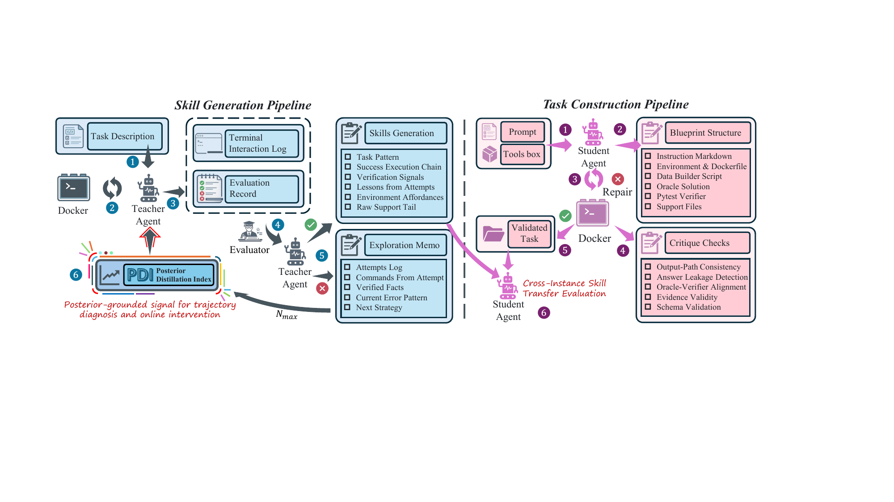
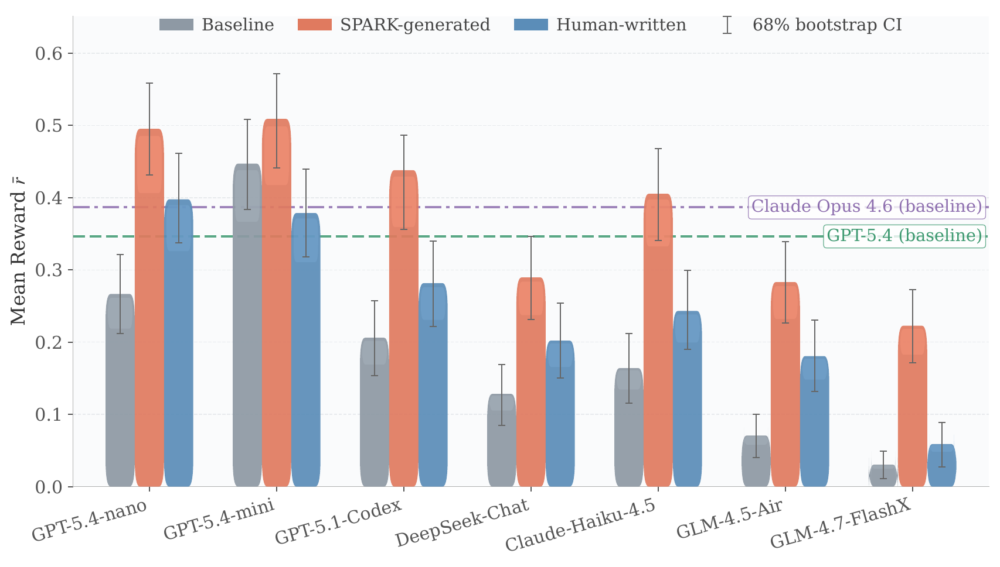

# SPARK

> **Evidence Over Plans: Online Trajectory Verification for Skill Distillation**
>
> *Structured Pipelines for Autonomous Runnable tasKs and sKill generation*

<p align="center">
  <a href="https://etayang10th.github.io/spark.github.io/">
    
  </a>
  <a href="https://github.com/EtaYang10th/spark-skills">
    
  </a>
</p>

<p align="center">
  🔗 <b>Project page / Blog:</b> <a href="https://etayang10th.github.io/spark.github.io/">https://etayang10th.github.io/spark.github.io/</a>
</p>

<p align="center">
  
</p>

SPARK is a research prototype that turns **environment-verified trajectories** into reusable agent skills. It is built around two pipelines that compose naturally:

- **Skill generation** — a teacher agent explores a Dockerized task, and a successful trajectory is distilled into a `SKILL.md`.
- **Task construction** — a natural-language prompt is built-and-verified into a runnable, oracle-validated task.

At the centre sits the **Posterior Distillation Index (PDI)** — a trajectory-level score that measures whether a skill is grounded in posterior execution evidence rather than stale prior plans. SPARK uses PDI both as a retrospective diagnostic and as an online intervention signal during exploration.

---

## Highlights

- **Posterior over prior.** Skills are distilled from what the agent *actually observed* in the environment, not from a pre-written plan.
- **Online PDI intervention.** A memo-based PDI proxy monitors exploration in real time and nudges the teacher when trajectories start to ossify.
- **Transferable, cheap student inference.** On 86 tasks across 11 domains, SPARK-generated skills consistently beat no-skill baselines and outperform human-written ones on most student models — student inference runs at roughly `$0.02` per task, up to **1,000× cheaper** than teacher exploration.
- **Full-trajectory logging.** Every run preserves execution logs, verifier signals, and memo histories for trajectory-level analysis.

<p align="center">
  
</p>

---

## How it works

The skill-generation loop is `execute → judge → reflect → retry → distill`:

1. The teacher agent interacts with a Dockerized environment for up to `N_max` attempts.
2. Each attempt produces a terminal interaction log and a verifier record.
3. **On success** — the full trajectory is compiled into six evidence blocks and distilled into `SKILL.md`:
   *Task Pattern · Execution Chain · Verification · Lessons · Environment · Raw Support Tail.*
4. **On failure** — a five-section *exploration memo* is **completely rewritten** to carry forward only what is useful:
   *Attempts Log · Commands · Verified Facts · Current Error Pattern · Next Strategy.*
   A PDI proxy can then trigger targeted interventions before the next retry.
5. The distilled skill is evaluated cross-model: a weaker student agent runs the same (or independently constructed) tasks with the injected `SKILL.md`.

The task-construction pipeline follows a `blueprint → repair → critique → oracle-validate` pattern; only tasks that pass deterministic oracle verification are accepted.

---

## Requirements

- Python `3.12`
- [`uv`](https://github.com/astral-sh/uv)
- Docker with a working [Harbor](https://github.com/laude-institute/harbor) setup
- An OpenAI-compatible LLM endpoint *(optional: DashScope / DeepSeek / Zhipu are auto-routed by the helper scripts)*

Both pipelines read `OPENAI_API_KEY` and `OPENAI_BASE_URL` from the environment. A local `.env` file is auto-loaded if present:

```bash
cp .env_example .env
```

If you use the helper shell scripts, also fill in `DASHSCOPE_API_KEY` for the qwen workflows.

---

## Quick start

### 1. Install

```bash
uv sync
```

### 2. Generate a task from a prompt

Use the example spec in `spark_tasks_gen/examples/3d_scan_calc_prompt.json`, or write your own JSON with `prompt`, `available_tools`, `environment_hints`, and `constraints`:

```bash
uv run python run_tasks_gen.py \
  --prompt-file spark_tasks_gen/examples/3d_scan_calc_prompt.json \
  --model gpt-5.4
```

The pipeline runs `blueprint → repair → critique → oracle validation` and writes the accepted task to `spark_tasks_gen/generated_tasks/<task-id>/`.

### 3. Generate skills from tasks

```bash
uv run python run_pipeline.py \
  --agent qwen-coder \
  --model qwen3-coder-next \
  --tasks-dir tasks-no-skills \
  --max-retries 3 \
  --parallelism 4
```

Useful flags:

| Flag | Purpose |
|---|---|
| `--pdi-enabled` | Turn on PDI-guided online intervention. |
| `--pdi-observe-only` | Compute PDI without intervening (diagnostics). |
| `--pdi-method {token_overlap,js_divergence}` | Choose the PDI proxy. |
| `--resume` / `--shuffle` / `--shared-result-dir` | Iterative and multi-model workflows. |
| `--no-dashboard` | CLI-only mode (dashboard defaults to <http://localhost:8765>). |

### 4. Evaluate generated skills

`run_eval_skills.py` runs a three-way comparison on the subset of tasks that already have a generated `SKILL.md`:

| Phase | Setup |
|---|---|
| `baseline` | Original `tasks-no-skills`, no skill injected. |
| `generated` | SPARK's `SKILL.md` injected into a staged task under `save/`. |
| `human` | Human-written skills from SkillsBench. |

```bash
uv run python run_eval_skills.py \
  --agent qwen-coder \
  --model qwen3-coder-next \
  --skill-source-model qwen3-coder-next \
  --tasks-dir tasks-no-skills
```

Staging copies are written under `save/` and removed after each run.

---

## Repository layout

```
code/
├── run_tasks_gen.py              # task construction CLI
├── run_pipeline.py               # skill generation CLI (+ dashboard)
├── run_eval_skills.py            # 3-way skill evaluation CLI
├── spark_tasks_gen/              # prompt → blueprint → critique → oracle
├── spark_skills_gen/             # execute → judge → reflect → distill
│   ├── pipeline.py               # main loop
│   ├── skill_evidence.py         # six evidence blocks
│   ├── summarizer.py             # reflect + distill LLM calls
│   ├── judge.py                  # parse result.json → PASS / FAIL / PARTIAL
│   ├── trajectory.py             # trajectory writer + PDI signals
│   └── dashboard/                # FastAPI live dashboard
├── scripts/                      # convenience wrappers (conda env `spark`)
├── figure/                       # illustrations
└── tasks* / save / spark-jobs    # task sources, staging, Harbor outputs
```

### Outputs

After a typical run you will find:

- generated Harbor tasks — `spark_tasks_gen/generated_tasks/<task-id>/`
- task-generation traces — `spark_tasks_gen/generated_tasks/_artifacts/<task-id>/`
- Harbor execution outputs — `spark-jobs/`
- distilled skills and attempt logs — `spark_skills_gen/skills_gen_result/<model>/<task>/`
- evaluation summaries — `spark_skills_gen/skills_eval_result/<model>/<run-id>/`

---

## Demo

<p align="center">
  
</p>

---

## Getting the SkillsBench tasks

`tasks/` and `tasks-no-skills/` reuse the task suite from [SkillsBench](https://github.com/benchflow-ai/skillsbench) ([paper](https://arxiv.org/abs/2602.12670)). A minimal sparse-checkout:

```bash
git clone --filter=blob:none --no-checkout https://github.com/benchflow-ai/skillsbench.git
cd skillsbench
git sparse-checkout init --cone
git sparse-checkout set tasks tasks-no-skills
git checkout main
```

Then copy the folders into your SPARK workspace:

```bash
cp -r skillsbench/tasks            /path/to/SPARK/code/
cp -r skillsbench/tasks-no-skills  /path/to/SPARK/code/
```

---

## Helper scripts

Local convenience wrappers (they assume a `conda` env named `spark`):

- `bash scripts/run_tasks_gen.sh`
- `bash scripts/run_skills_gen.sh`
- `bash scripts/run_eval_skills.sh`

`run_skills_gen.sh` auto-routes credentials for DashScope / DeepSeek / Zhipu based on the model prefix; the Python entry points above remain the more portable option.

---

## Citation

If SPARK or PDI helps your research, please cite:

```bibtex
@misc{spark2026,
  title  = {Evidence Over Plans: Online Trajectory Verification for Skill Distillation},
  author = {Zhou, Yang and Dong, Zihan and Wang, Zhenting and Jin, Can and
            Zhao, Shiyu and Guo, Bangwei and Gu, Difei and Zhang, Linjun and
            Zhou, Mu and Metaxas, Dimitris N.},
  year   = {2026}
}
```
