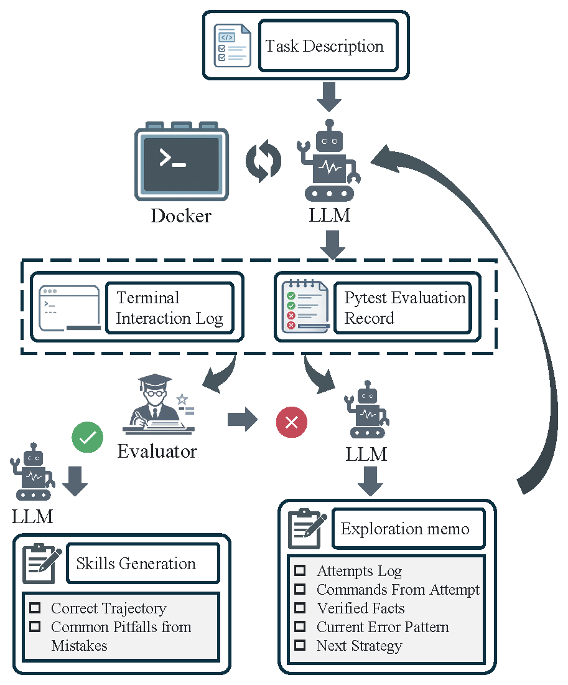

# SPARK: Self-evolving Pipelines for Autonomous Runnable tasKs and sKill generation [Anonymous]


SPARK is a research prototype for autonomous task construction and skill generation.

- `spark_tasks_gen` 🧩 turns a prompt plus tool and environment hints into a runnable, oracle-validated Harbor task.
- `spark_skills_gen` 🔁 runs agents on validated tasks, learns from retries, and distills successful trajectories into `SKILL.md`.

`tasks-no-skills` currently reuses tasks migrated from `skillsbench`, but SPARK itself is focused on building a new workflow rather than reproducing that benchmark.

## Demo 🎬


## Overview 🚀

SPARK keeps task construction and skill generation as two separate pipelines:

- Task pipeline: `prompt -> retrieval -> TaskBlueprint -> Harbor task -> oracle validation`
- Skill pipeline: `execute -> judge -> summarize -> retry -> distill skill`

This split keeps the system simpler to iterate on: tasks can improve independently, and skills can be distilled from validated trajectories without hand-authoring both sides.

## Skill-Generation Pipeline 🔁

The iterative skill-generation loop follows a retry-with-reflection pattern. For each task, the agent attempts execution inside a Harbor/Docker container. A judge parses `result.json` to determine PASS / FAIL / PARTIAL and extracts structured signals (agent commands and test summary). On success, an LLM distills the trajectory into a `SKILL.md`. On failure, a Reflect LLM produces an **exploration memo** that is injected into the instruction for the next retry.




## Getting Tasks from SkillsBench 🙏

If you want the original `tasks/` and `tasks-no-skills/` folders, the easiest option is to fetch them from [SkillsBench](https://github.com/benchflow-ai/skillsbench), introduced in the paper [*SkillsBench: Benchmarking How Well Agent Skills Work Across Diverse Tasks*](https://arxiv.org/abs/2602.12670).

```bash
git clone --filter=blob:none --no-checkout https://github.com/benchflow-ai/skillsbench.git
cd skillsbench
git sparse-checkout init --cone
git sparse-checkout set tasks tasks-no-skills
git checkout main
```

Then copy the folders into your local SPARK workspace as needed:

```bash
cp -r skillsbench/tasks /path/to/SPARK/
cp -r skillsbench/tasks-no-skills /path/to/SPARK/
```

## Requirements 🛠️

- Python 3.12
- `uv`
- Docker and a working Harbor setup
- Access to an OpenAI-compatible LLM endpoint

Both pipelines read `OPENAI_API_KEY` and `OPENAI_BASE_URL` from the environment. A local `.env` file is also loaded automatically if present. You can start from the included template:

```bash
cp .env_example .env
```

If you use the helper shell scripts, also fill `DASHSCOPE_API_KEY` in `.env`.

## Quick Start ⚡

### Install dependencies

```bash
uv sync
```

### Generate a task from a prompt

Use the example prompt spec in `spark_tasks_gen/examples/3d_scan_calc_prompt.json`, or provide your own JSON file with fields such as `prompt`, `available_tools`, `environment_hints`, and `constraints`.

```bash
uv run python run_tasks_gen.py \
  --prompt-file spark_tasks_gen/examples/3d_scan_calc_prompt.json \
  --model gpt-5.4
```

This produces a Harbor task under `spark_tasks_gen/generated_tasks/` and validates it with Harbor oracle execution before accepting it.

### Run the iterative skill-generation loop

```bash
uv run python run_pipeline.py \
  --agent qwen-coder \
  --model qwen3-coder-next \
  --tasks-dir tasks-no-skills \
  --max-retries 3 \
  --parallelism 4
```

The dashboard is enabled by default at `http://localhost:8765`. Use `--no-dashboard` if you only want CLI output.

## Helper Scripts 🧰

Two convenience scripts are included for local workflows:

- `bash scripts/run_tasks_gen.sh`
- `bash scripts/run_skills_gen.sh`
- `bash scripts/run_eval_skills.sh`

These wrappers assume a local `conda` environment named `spark`, so the Python entry points above are the more portable way to run the project. `run_tasks_gen.sh` preserves an explicitly configured `OPENAI_API_KEY` / `OPENAI_BASE_URL`, while the qwen-oriented wrappers `run_skills_gen.sh` and `run_eval_skills.sh` export DashScope compatibility settings whenever `DASHSCOPE_API_KEY` is present.

### Evaluate generated skills

`run_eval_skills.py` compares the same subset of tasks twice:

- baseline: run the original `tasks-no-skills` tasks directly
- with generated skills: copy only the comparable tasks into a temporary staging directory under `save/`, inject each generated `SKILL.md`, rerun Harbor, and delete that staging directory after the run finishes

Only tasks with `spark_skills_gen/skills_gen_result/<skill-model>/<task>/SKILL.md` are included, so tasks without a generated skill are skipped by construction.

```bash
uv run python run_eval_skills.py \
  --agent qwen-coder \
  --model qwen3-coder-next \
  --skill-source-model qwen3-coder-next \
  --tasks-dir tasks-no-skills
```

## Outputs 📦

After a typical run, you will see:

- generated Harbor tasks in `spark_tasks_gen/generated_tasks/<task-id>/`
- task-generation traces in `spark_tasks_gen/generated_tasks/_artifacts/<task-id>/`
- Harbor execution outputs in `spark-jobs/`
- distilled skills and attempt logs in `spark_skills_gen/skills_gen_result/<model>/<task-name>/`
- generated-skill evaluation summaries in `spark_skills_gen/skills_eval_result/<model>/<run-id>/`

The skill-generation pipeline also stages retry-edited tasks under `save/` temporarily and removes those staging copies once Harbor finishes each attempt.
